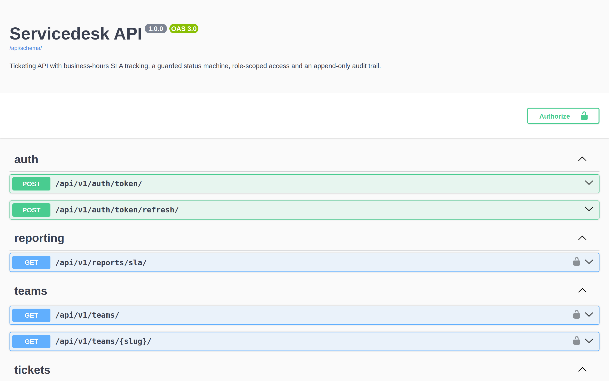

<!-- ══════════════════════════ TITLE ══════════════════════════ -->
<div align="center">
  
</div>

<!-- ══════════════════════ IDIOMAS / LANGUAGES ══════════════════════ -->
<div align="center">
<a href="README.md"></a>
<a href="README.en.md"></a>
<a href="README.es.md"></a>
</div>

<div align="center">


</div>

<div align="center">
<a href="#whats-in-here"></a>
<a href="#quickstart"></a>
<a href="#how-the-sla-clock-works"></a>
<a href="#architecture"></a>
<a href="#api"></a>
</div>

<br/>

> ⏱️ **A ticket opened at 5pm Friday with a 2 hour target is due at 10am Monday**, not 7pm Friday. The clock only ticks working minutes.

<div align="center">
  
</div>

## What is in here

- **Business-hours SLA engine** ([`tickets/sla.py`](tickets/sla.py)) with no dependencies beyond the standard library. Working days, opening hours, holidays and timezones. Pure functions, covered by 14 tests on their own.
- **Guarded status machine** ([`tickets/services.py`](tickets/services.py)). Every move is checked against an explicit transition table, so a cancelled ticket cannot quietly come back to life. Illegal moves answer `409 Conflict` instead of corrupting the record.
- **A clock that pauses.** Moving a ticket to *Pending requester* stops the resolution timer, and resuming pushes the deadline forward by exactly the working minutes that were lost.
- **Automatic escalation.** A Celery beat job sweeps for breaches every few minutes, stamps them, raises the escalation level and reassigns the ticket to the team lead. The sweep is idempotent.
- **Append-only audit trail.** Creation, status changes, assignments, comments, breaches and escalations all land in `AuditEvent`, written only by the service layer.
- **Role-scoped access.** Requesters see and reply on their own tickets. Agents see their team queues. Internal notes never reach the person who opened the ticket.
- **Priority repricing.** Raising a ticket from Normal to Urgent recomputes both deadlines under the new policy.
- **OpenAPI schema** served by drf-spectacular, with Swagger UI on the root URL.
- **60 tests**, ruff clean, `check --deploy` clean, CI on GitHub Actions.

## Quickstart

**With Docker:**
```bash
git clone https://github.com/geoggrigori/servicedesk.git
cd servicedesk
docker compose up --build
```
That brings up PostgreSQL, Redis, the API, a Celery worker and beat. It migrates and seeds demo data on the way up. Open <http://localhost:8000> for the API docs and <http://localhost:8000/admin/> for the admin — log in as `admin` / `demo12345`.

**Without Docker:**
```bash
python -m venv .venv && source .venv/bin/activate
pip install -r requirements-dev.txt
cp .env.example .env

python manage.py migrate
python manage.py seed_demo
python manage.py runserver
```
SQLite is the default. Point `DATABASE_URL` at PostgreSQL when you want it.

To watch the SLA sweeper work, run the worker and the scheduler in two more terminals:
```bash
celery -A config worker -l info
celery -A config beat -l info
```

## How the SLA clock works

A policy sets two targets per priority, per team, in minutes:

| Priority | First response | Resolution |
|---|---|---|
| Urgent | 15 min | 4 h |
| High | 1 h | 8 h |
| Normal | 4 h | 24 h |
| Low | 8 h | 48 h |

Those minutes are **working** minutes. With a Monday to Friday, 09:00 to 18:00 calendar:
- A ticket opened at **17:00 Friday** with a 2 hour target is due at **10:00 Monday**, not 19:00 Friday.
- A ticket opened at **3am** starts counting at 09:00.
- A holiday listed in `BUSINESS_HOLIDAYS` is skipped like a weekend.
- Time spent in *Pending requester* is added back to the deadline, again in working minutes only.

A policy can opt out with `business_hours_only=False` and fall back to plain wall clock time, for 24/7 teams.

## Architecture

```
config/          settings, Celery app, beat schedule, URLs
accounts/        custom user model with admin / agent / requester roles
tickets/
  models.py      Team, SlaPolicy, Ticket, Comment, AuditEvent
  sla.py         business-hours arithmetic, pure functions
  services.py    the only place tickets change: state machine + audit
  tasks.py       the breach sweeper and the escalation job
  views.py       DRF viewsets, custom actions, SLA report
```

The rule the codebase leans on: **nothing mutates a ticket outside `services.py`**. The API, the admin actions and the Celery jobs all call the same functions, which is why the status machine, the SLA timestamps and the audit trail cannot drift apart.

## API

Authenticate with JWT:
```bash
curl -X POST localhost:8000/api/v1/auth/token/ \
  -H 'Content-Type: application/json' \
  -d '{"username": "agent1", "password": "demo12345"}'
```

| Method | Endpoint | What it does |
|---|---|---|
| `GET` | `/api/v1/tickets/` | List, scoped to what the caller may see |
| `POST` | `/api/v1/tickets/` | Open a ticket, deadlines computed on the spot |
| `POST` | `/api/v1/tickets/{id}/transition/` | Move status, `409` if the machine forbids it |
| `POST` | `/api/v1/tickets/{id}/assign/` | Assign to an agent |
| `POST` | `/api/v1/tickets/{id}/priority/` | Reprice, recomputing both deadlines |
| `GET`/`POST` | `/api/v1/tickets/{id}/comments/` | Read or add a reply, public or internal |
| `GET` | `/api/v1/reports/sla/` | Queue health counters, agents only |
| `GET` | `/api/schema/` | OpenAPI 3 schema |

Useful filters: `?status=new&status=in_progress`, `?breached=true`, `?unassigned=true`, `?team=infra`, `?search=TCK-00042`.

## Tests

```bash
pytest              # 60 tests
ruff check .        # lint
```

The suite is deliberately weighted toward the rules rather than the plumbing: the business-hours arithmetic, the transition table, the pause/resume behaviour, and the idempotency of the sweeper.

## Configuration

Everything is read from the environment — see [`.env.example`](.env.example) for the full list.

| Variable | Default | Notes |
|---|---|---|
| `TIME_ZONE` | `America/Sao_Paulo` | The calendar is evaluated in this zone |
| `BUSINESS_WORKDAYS` | `0,1,2,3,4` | Monday is 0 |
| `BUSINESS_START`/`BUSINESS_END` | `09:00`/`18:00` | |
| `SLA_SWEEP_MINUTES` | `5` | How often the sweeper runs |

## License

[MIT](LICENSE).

<div align="center">
  
</div>

<p align="center"><sub>Built by <strong><a href="https://github.com/geoggrigori">Grigori</a></strong> · 2026</sub></p>
